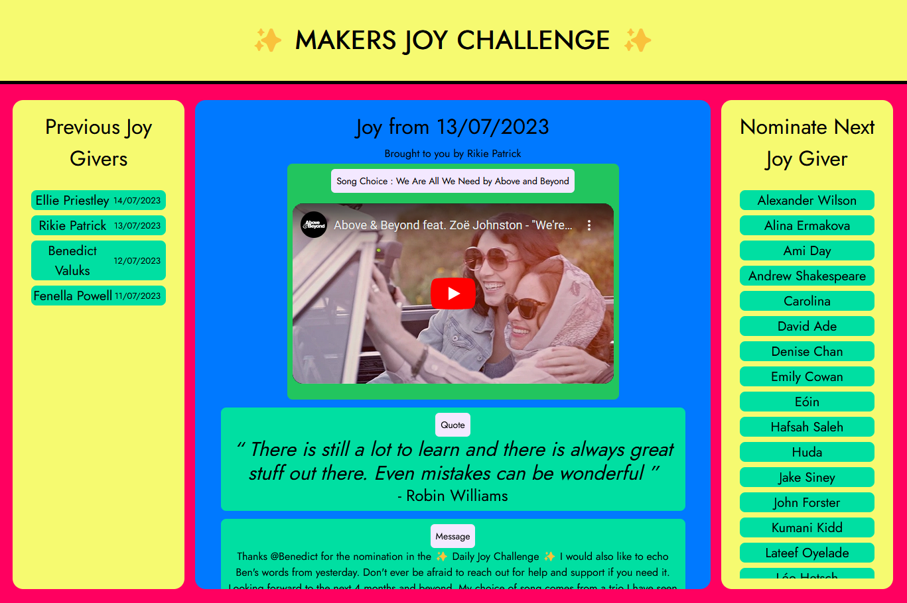

# Makers Joy Challenge

> This app shows all the previous 'Joy Givers' from the July 2023 Makers Cohort

This has been created with npx degit apicgg/vite-mern-template using the official [Vite](https://vitejs.dev/) template (`npm create vite@latest`) and some extended setup. There are two separate folders called `server` and `client`. The entry point for the backend is `server/src/index.js`.

> Thanks to [apicgg](https://github.com/apicgg/) for creating this project starter.

## Tools

> Not all are used yet
- [React](https://reactjs.org/)
- [Tailwind CSS](https://tailwindcss.com/)
- [TypeScript](https://www.typescriptlang.org/)
- [Redux Toolkit](https://redux-toolkit.js.org/)
- [Axios](https://axios-http.com/)
- [React Router DOM](https://reactrouter.com/)
- [Express](https://expressjs.com/)
- [mongoose](https://mongoosejs.com/)
- [bcrypt.js](https://www.npmjs.com/package/bcryptjs)
- [jsonwebtoken](https://www.npmjs.com/package/jsonwebtoken)
- [express-async-handler](https://www.npmjs.com/package/express-async-handler)

## Preview



## Installation

```bash
npx degit 1sAndZeros/makers-joy-challenge my-app
```

## Install dependencies

```bash
cd my-app
cd client
npm install
cd ..
npm install
```

## Start the development server

```bash
npm run watch
npm run dev
```

- Run the above two commands on different terminal sessions.

- Remove the .git folder and initialize your own git repository.
- In this case `npm run watch` needs to be executed before starting the development server with `npm run dev` as the TypeScript files need to be compiled to JavaScript before staring the dev server with node. `ts-node` can be used this to avoid this.

## TODO

- Add Button
- Random Selector
- Make Responsive

## License

MIT License.

Please review the [License](https://github.com/1sAndZeros/makers-joy-challenge/blob/main/LICENSE).

## Contributors ✨

Contributions of any kind welcome! Kindly have a look into [Contributing Guidelines](CONTRIBUTING.md)
